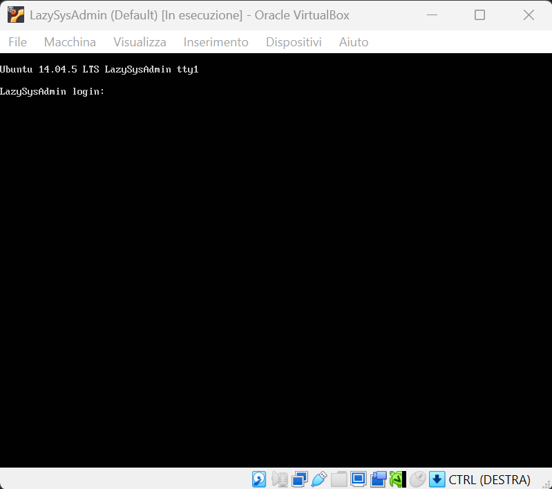
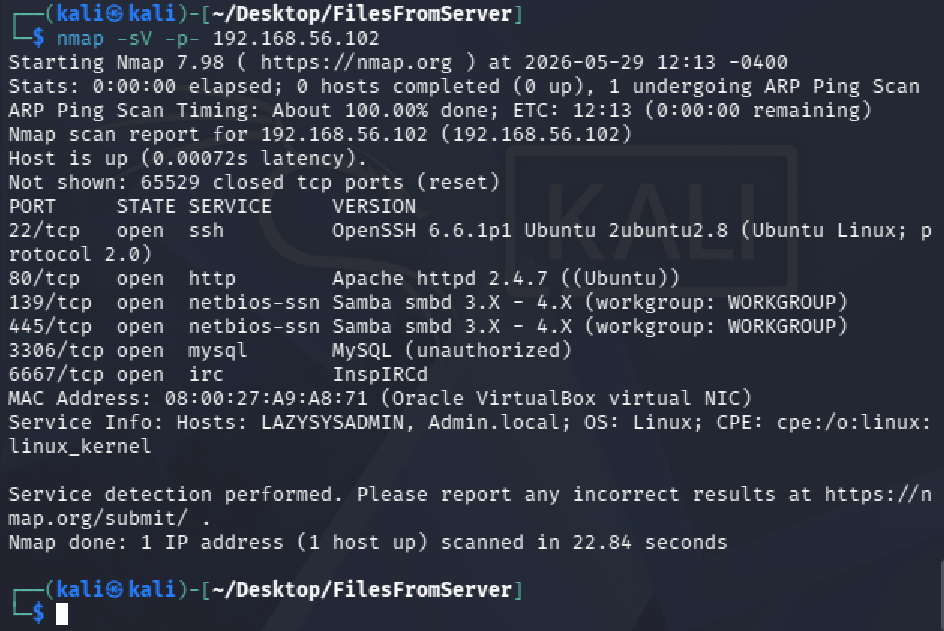
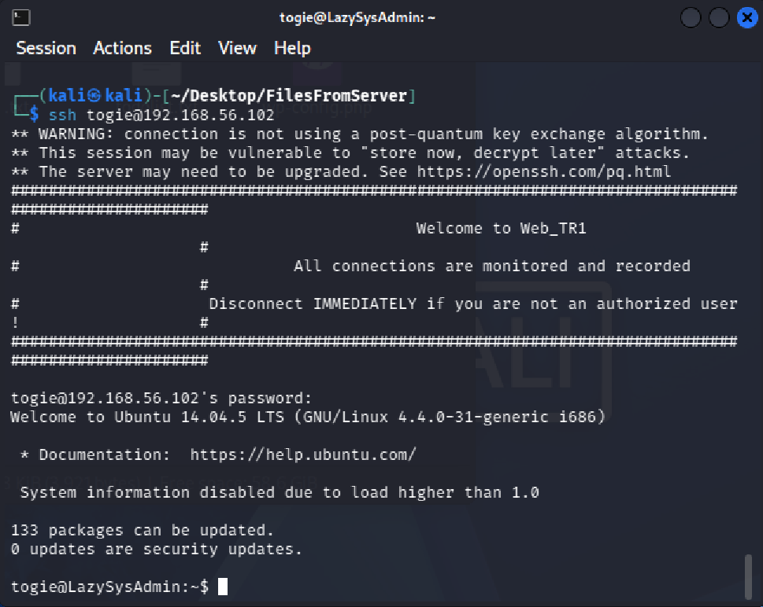
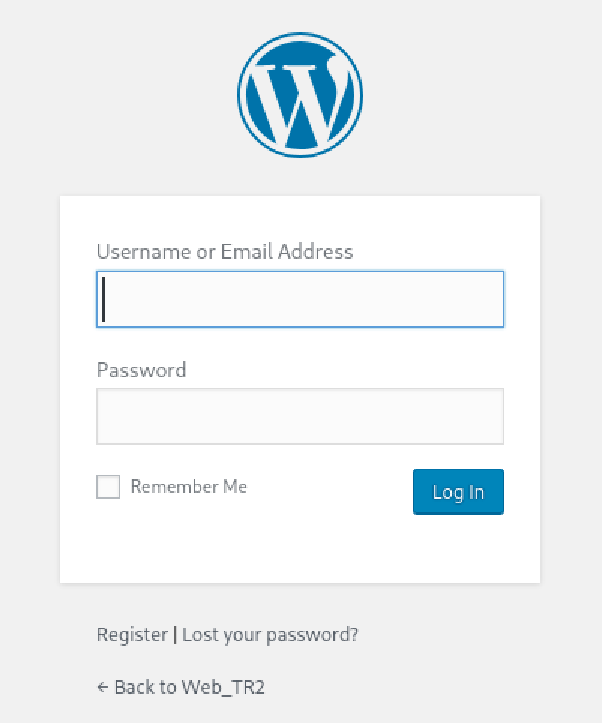
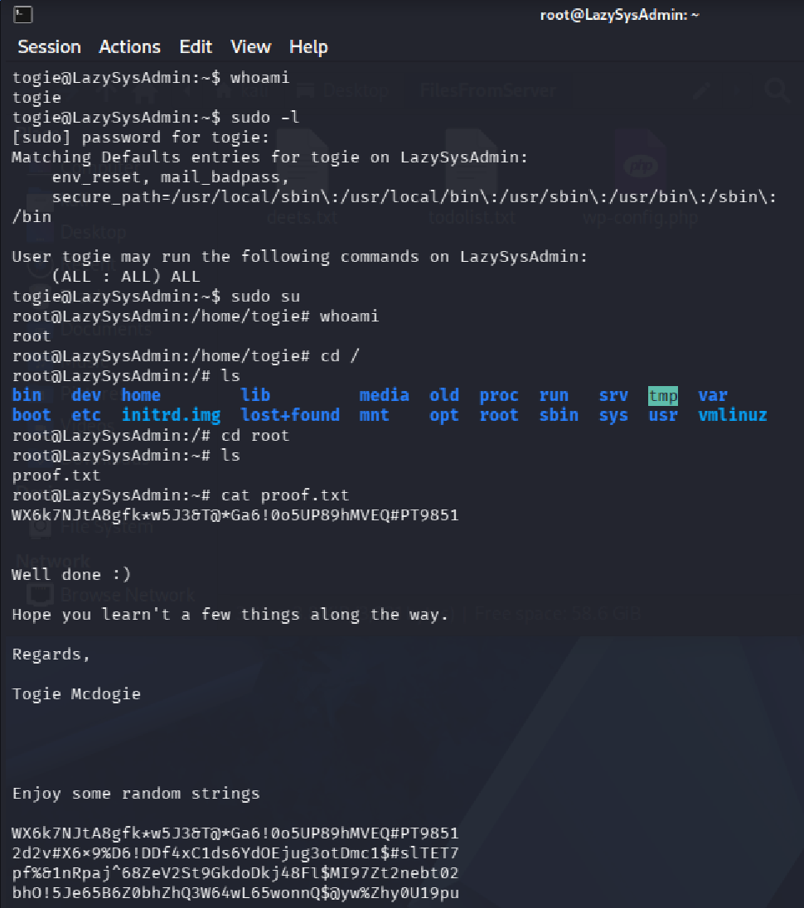
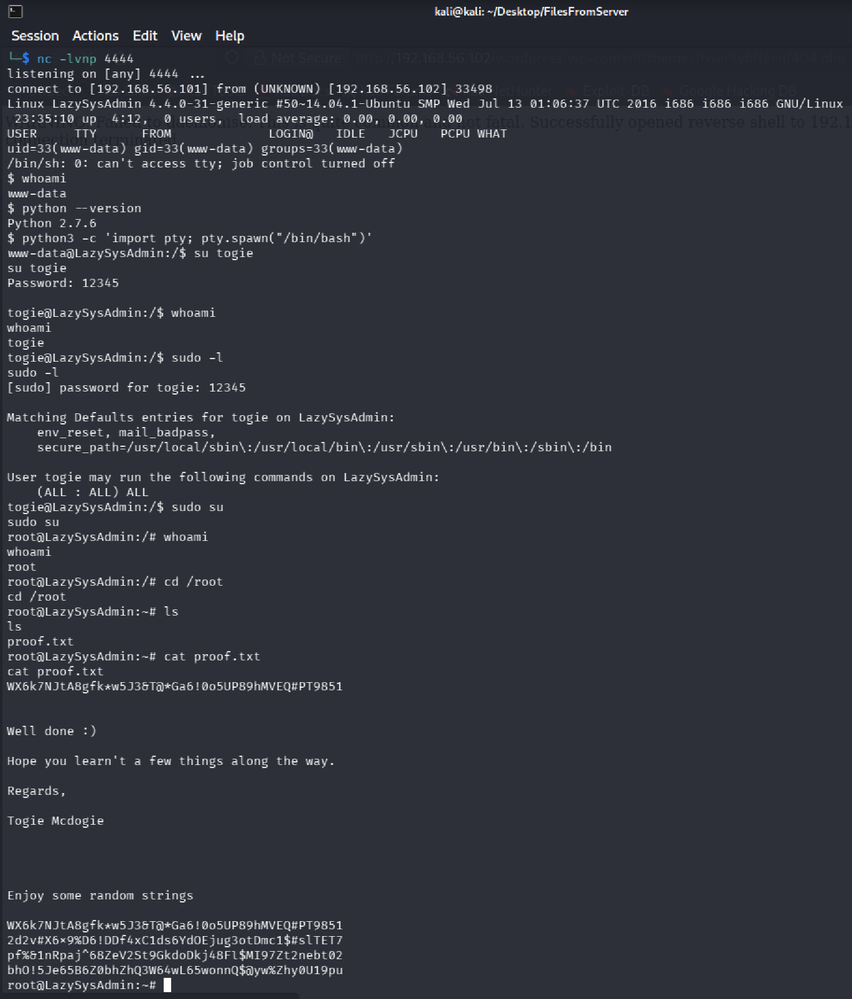

# LazySysAdmin CTF walkthrough

This small project aims to breach the vulnerable VM **[LazySysAdmin](https://www.vulnhub.com/entry/lazysysadmin-1,205/ "Download the VM")** found on VulnHub, a Boot-to-Root challenge with full writeup available on [this article](https://www.hackingarticles.in/hack-lazysysadmin-vm-ctf-challenge/ "See the original writeup"), to demonstrate how misconfigurations and poor administrative practices can lead to a deep compromise in just few minutes.  
> _Note_: at the beginning the project started following the writeup mentioned but subsequently evolved into a different approach. To see the original idea follow the link above.


## Threat model & environment

> ⚠️**Threat model**: attacker is able to communicate with the vulnerable service (e.g., service has public IP & vulnerable ports open)

Environment: _Kali Linux_ (attacker) vs _LazySysAdmin_ (victim) within the same Host-Only VirtualBox isolated network to secure the test environment.  

The _LazySysAdmin_ machine will be constantly waiting for interactive logon while attacker is operating beneath.   




## Idea of attack structure

The following schema is just to have an idea of the attack structure, it is not meant to be the exact path followed.
1. **Reconnaissance**: `nmap` for port scanning and service identification
2. **Discovery**: `smbclient` for exploring victim's SMB shared objects and analyzing configuration files
3. **Initial Access & Exploitation**:
    * **Valid Accounts**: abuse of admin's valid credentials through remote SSH access
    * **Exploit Public-Facing Application**: abuse of admin database's valid credentials to obtain a Reverse Shell through WordPress' admin panel
4. **Execution**: RCE via Reverse Shell using Python `pty` module
5. **Privilege Escalation** & CTF: abusing permissive configuration in `/etc/sudoers` (`ALL:ALL ALL`) to obtain interactive shell as _root_ & completing the challenge "capturing the flag" inside _root_'s directory   


### 1. Reconnaissance

It is implicit - by threat model - that the attacker already knows the public IP of target service (in this case due to VirtualBox configuration).  
I started the attack doing a scan of the open services of the target machine using `nmap` with options:
* `-sV`: probe open ports to determine service/version info
* `-p-`: if specified scans a specific port, otherwise all 65535 ports   

See the official [nmap documentation](https://man7.org/linux/man-pages/man1/nmap.1.html "nmap official manual page") for further information. 

    
Among all services there is Samba on port 139, a software implementing SMB network protocol natively used by Windows for sharing resources and enabling Unix-like systems to communicate with its networks.  
The command to interact with shared entities on those networks via terminal is `smbclient` and, for example, with the command:  
```bash
smbclient -L <serverIP>
```
it is able to list all shared directories of the target host.

---

### 2. Discovery <a id="ch2"></a>

A secure Samba configuration does not allow a guest user to access the shared objects inside the server but with this configuration instead it does. After connecting to the _share$_ folder with:  
```bash
smbclient '//<serverIP>/share$'
```
I was indeed able to access them with privileges of downloading files and traversing directories, so after searching for a while I noticed the files `deets.txt` and `wordpress/wp-config.php` in which, respectively, are contained:  
* password of host-admin account Togie (creator of the CTF) in cleartext: _12345_
* username and password of the service-admin control panel in WordPress: _Admin, TogieMYSQL12345^^_  

**Security implications**  
These findings higlight a critical flaw in administrative operations: _credential harvesting through data leakage_.  
* `deets.txt` suggests that the admin used the publicly available _share$_ folder as a temporary/permanent notepad for sensitive information
* `wp-config.php` is critical from a security point of view because WordPress stores database's credentials in plaintext to establish runtime connections

> For the following sections (3,4,5) I decided to take a partial detour from the original writeup because I noticed a simpler way of continuing the attack (follow the route "a" for SSH or "b" via Wordpress).

---

### 3a. Initial Access: Valid Accounts <a id="ch3parA"></a>

As we previously saw from the screenshot there is also an open SSH port that I tried to use with a bunch of simple usernames combined with the password of the host-admin account, having success with the one in the following screenshot.

  
I tried this specific username in particular because it is the username of the creator of the CTF, so in the context of the attack it is reasonable to assume that the attacker may know the username of the attacked account in advance (e.g., due to a leak or prior organization knowledge).  

Now I'm currently logged in as _togie_. In section ([5](#ch5)) we'll see how I used this connection.


### 3b. Exploitation: Exploit Public-Facing Application <a id="ch3parB"></a>

An alternative, longer and graphical way of reaching the same position starts from surfing the address `<serverIP>/wordpress/wp-admin/index.php` on the browser.  

  
This is the admin login page, in which I inserted the credentials of the admin database found inside the file at ([2](#ch2)) and successfully entered as WordPress admin.  

With these capabilities I altered one of the _php_ pages of the active template (I've chosen `404.php`) to inject a ready-to-use Reverse Shell, located at `/usr/share/webshells/php/php-reverse-shell.php` inside Kali, omitted for brevity and slightly modified to connect to the Kali machine (IP & port).  
However, a default version of the Reverse Shell is available at [my GitHub](php-reverse-shell.php "php-reverse-shell.php"). 

The Reverse Shell is preferable w.r.t. the Bind Shell from the attacker point of view because it forces the victim (upon triggering) to create an outbound connection to a machine attacker-controlled (Kali in this case), less likely to be blocked by perimeter defenses such as firewalls and NAT, in contrast with the Bind Shell.
 
A command-line tool not only useful for reading and writing data across network connections using TCP/UDP is Netcat (`nc`), it operates in two primary modes: Listen mode (acting as a server) and Connect mode (acting as a client).  
With the following command I set up a verbose listener on Kali on port 4444, the "server" of the connection:  
```bash
nc -lvnp 4444
```
>Observation: I've choosen port 4444 but if I wanted to make the attacker sneakier I could have just used a well-known port (e.g., 80, 443) to mimic a usual outbound connection.  

Then I triggered the Reverse Shell visiting the _php_ page just modified via browser, in my case `<serverIP>/wordpress/wp-content/themes/twentyfifteen/404.php`. 

---

### 4. Execution (only for (b) part)

So far the Reverse Shell allowed me to obtain a Shell inside the server but it is non-interactive, lacking a proper TTY, which prevents features like job control, proper input handling, and commands such as _su_. In addition, the account which I'm interacting with is the usual on which the Apache server runs (_www-data_). I, thus, verified that Python is installed and executed some Python commands to use the module `pty` to execute an interactive Shell, fooling the underlying Linux kernel into thinking that the session is originating from a legitimate local terminal emulator.
```bash
python -c 'import pty; pty.spawn("/bin/bash")'
```
This Shell allowed me to impersonate _togie_ using:
```bash
su togie
```
For a complete Python `pty` documentation see [pty: Pseudo-terminal utilities](https://docs.python.org/3/library/pty.html "Python official documentation").

---

### 5. Privilege Escalation & CTF <a id="ch5"></a>

> From now on the attack follows almost the same path.  

I executed the following command to know which commands _togie_ is able to execute:
```bash
sudo -l
```
The output is pretty self-explanatory: `(ALL:ALL) ALL`, meaning that this account is able to execute any command on the host.  
Executing `sudo su` I was able to become _root_, gaining full privileges on the machine, and complete the challenge capturing the flag:
* route [a](#ch3parA), via SSH

* route [b](#ch3parB), using the Reverse Shell



## Attack observations

This attack demonstrates the effectiveness of attacks based on misconfigurations. It was not necessary to exploit any vulnerability; the whole compromise was carried out abusing overprivileges and bad practices only.  

1. **Credential exposure**  
The compromise originated entirely from credential disclosure. The SMB _share$_ directory exposed sensitive files containing authentication material, simplifying subsequent phases of the attack
2. **Potential impact of (even partial) credential reuse**  
From a theoretical point of view, compromising the right set of credentials could compromise multiple trust boundaries (e.g., the ones of the server and of the service) or simplify future attack steps
3. **Critical flaw on application of _principle of least privilege_**  
A far too permissive `(ALL:ALL) ALL` _sudo_ configuration for the account _togie_ leveraged by the attacker led to a full system compromise. Even if earlier attack stages will be partially mitigated, obtaining access as this user would still result in a critical compromise. 
4. **CVE observation**  
The system was also affected by **CVE-2018-15473**, a user enumeration vulnerability in OpenSSH. However, exploiting this vulnerability was not necessary because enough information had already been obtained before the attack itself through disclosed credentials and contextual information


## Possible mitigations

The attack leverages only onto human errors, mainly violations to the _Principle of Least Privilege_.  
To secure the server it is needed to apply:
* **Samba configuration change**: disable anonymous _guest_ access to shared directories
* **Password policy hardening**: use for each IT entity a different, "complex" and "reasonably long" password (e.g., not the same between service and workstation)
* **Privilege restriction**: restrict privileges inside `/etc/sudoers` in a way that normal user (e.g., _togie_) cannot execute any command not useful on the pursuit of his actions
* **Log auditing**: implementing some logging policy allow to eventually generate alerts whenever local non-privileged user triggers _sudo -l_


## LLM usage

I discovered the (b) attack path asking [Gemini](https://gemini.google.com "Have a look at the LLM") to better explain the exploit steps of the writeup and I chose to follow it, and so diverge from the writeup's path, because it was easier to comprehend.  
I also relied on it for the rewriting of some English phrases that came out of my mind pretty disordered.